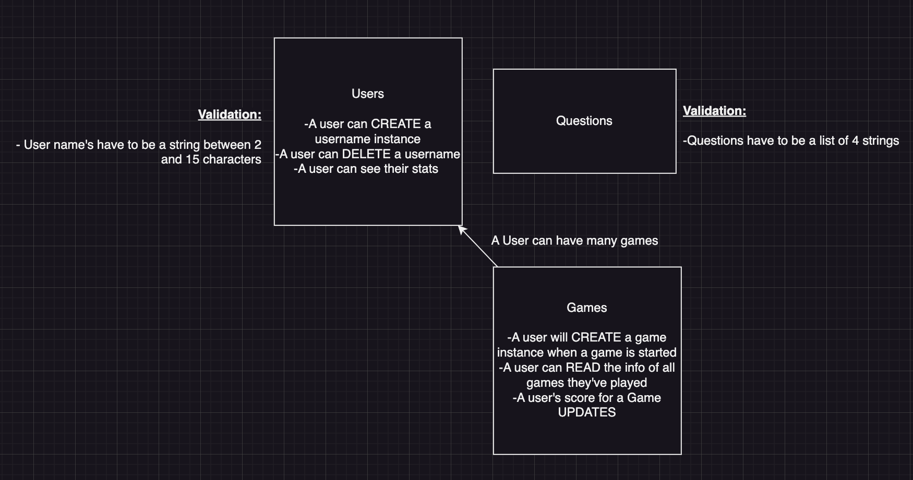

# Introduction

This is a simple command-line ‘Who Wants To Be A Millionaire” game in which a user 
can input their name, play the game, use lifelines to answer questions and view their high score which persists.

## Database Relationships

## Decision Tree

## Data Sample

## Kanban Board

